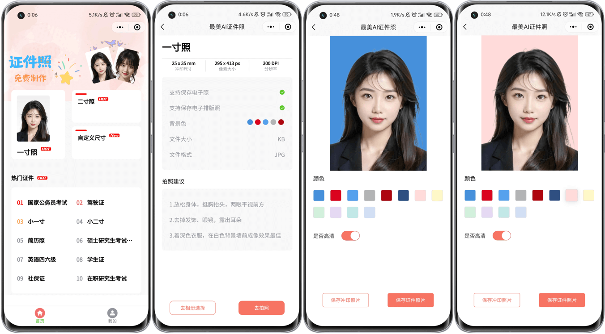

# HivisionIDPhotos-Uniapp

## 预览

<p align="center"></p>


# <p align="center">《最美AI证件照》</p>
<br>
<br>
<p align="center"></p>
<hr>

## 项目介绍
基于[Zeyi-Lin](https://github.com/Zeyi-Lin)大佬的[HivisionIDPhotos](https://github.com/Zeyi-Lin/HivisionIDPhotos)项目为基础，编写的一套生成证件照的微信小程序<br>
这里主要是微信小程序的页面 ，后台还在努力开发中~

## 🤩 主要功能
- #### 人像抠图
- #### 照片换底色
- #### 生成六寸排版照
- #### 自定义证件照尺寸
- #### 保存图片至用户相册

## ⭐ 项目技术栈

- Uniapp
- Vue2
- Vuex
- Typescript
- Uview
#### 为什么不用Vue3?
因为Uview对Vue3的支持不是很好...

## 📦 运行方法

- ### 下载依赖

```
yarn install
```

- ### H5启动

```
yarn serve
```

- ### 微信小程序启动

```
yarn dev:mp-weixin
```

然后项目目录下会生成一个dist目录 <br>
使用微信开发者工具打开dist目录下的 dev/mp-weixin目录 <br>
即可在微信开发者工具中看到该程序 <br>

- ### 发布微信小程序

```
yarn build:mp-weixin
```

该命令会打包符合微信小程序代码规范的极简包
然后以和上面dev版相同方式用微信开发者工具打开项目即可

 ## 📧 联系我
soulerror@qq.com


